# Architecture — Leave Management System

## Overview

Node.js microservices backend for employee leave management. TypeScript, ESM, Fastify, in-memory stores, Consul discovery, RabbitMQ notifications.

---

## 1. High-level system architecture

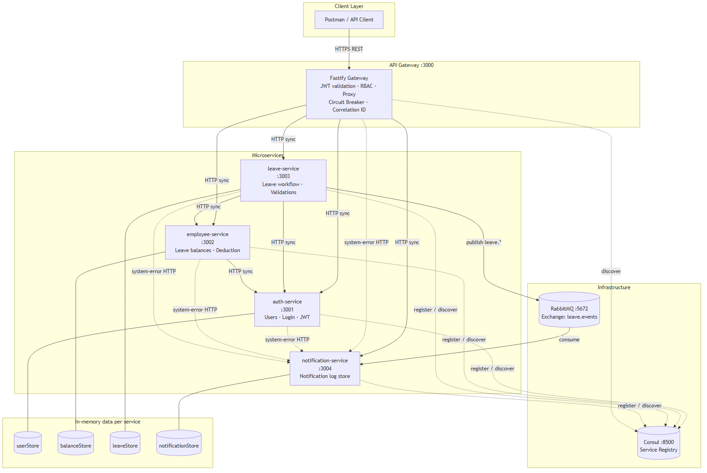

<details>
<summary>Show Mermaid source</summary>

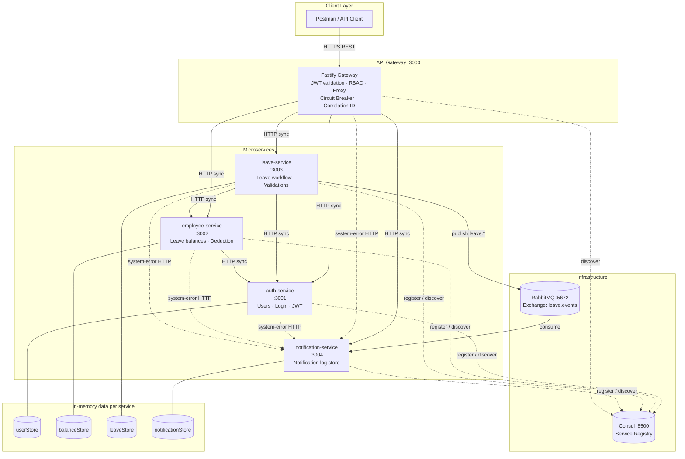

</details>

---

## 2. Service responsibilities

| Service | Port | Responsibility |
|---|---|---|
| **api-gateway** | 3000 | Public API entry, JWT validation, RBAC, HTTP proxy via Consul, circuit breaker |
| **auth-service** | 3001 | User store, login, JWT issuance, team lookup |
| **employee-service** | 3002 | Leave balance allocation (12/10/15), balance queries, deduction on approval |
| **leave-service** | 3003 | Apply / history / team view / approve / reject / cancel, validations, event publishing |
| **notification-service** | 3004 | Consumes RabbitMQ events, stores notification log entries, system-error logging |
| **Consul** | 8500 | Service registration, health checks, discovery |
| **RabbitMQ** | 5672 | Async messaging for leave lifecycle notifications |

---

## 3. Synchronous request flow (Approve leave)

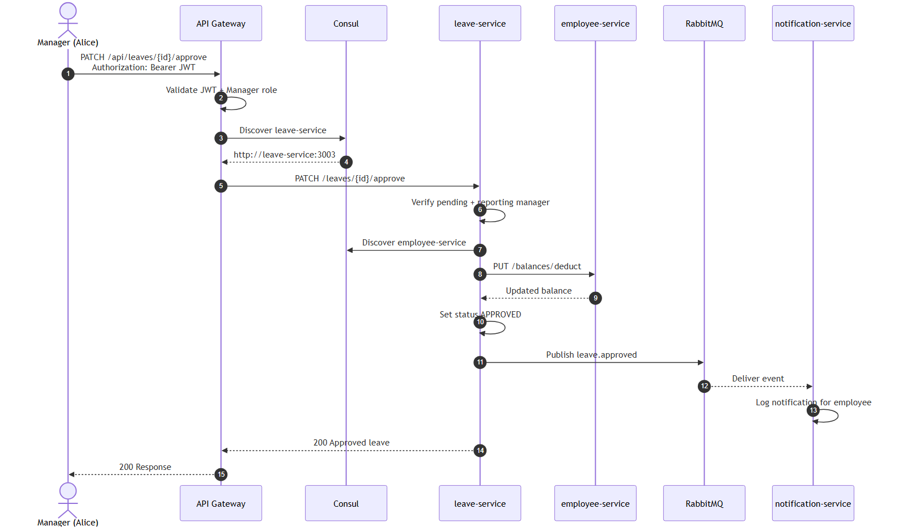

<details>
<summary>Show Mermaid source</summary>

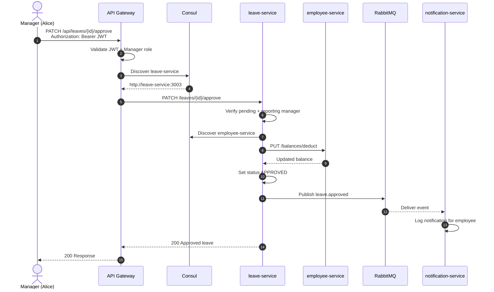

</details>

---

## 4. Asynchronous notification flow


<details>
<summary>Show Mermaid source</summary>

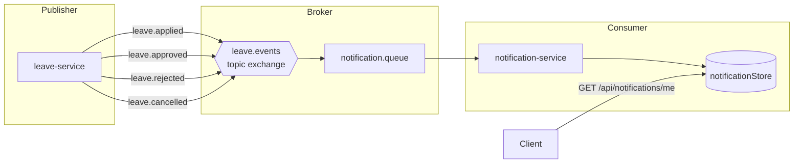

</details>

| Event | Recipients notified |
|---|---|
| `leave.applied` | Employee + Manager |
| `leave.approved` | Employee |
| `leave.rejected` | Employee (with reason) |
| `leave.cancelled` | Employee + Manager |
| `system.error` (HTTP) | Authenticated user (on 500/503) |

---

## 5. Service discovery & health checks

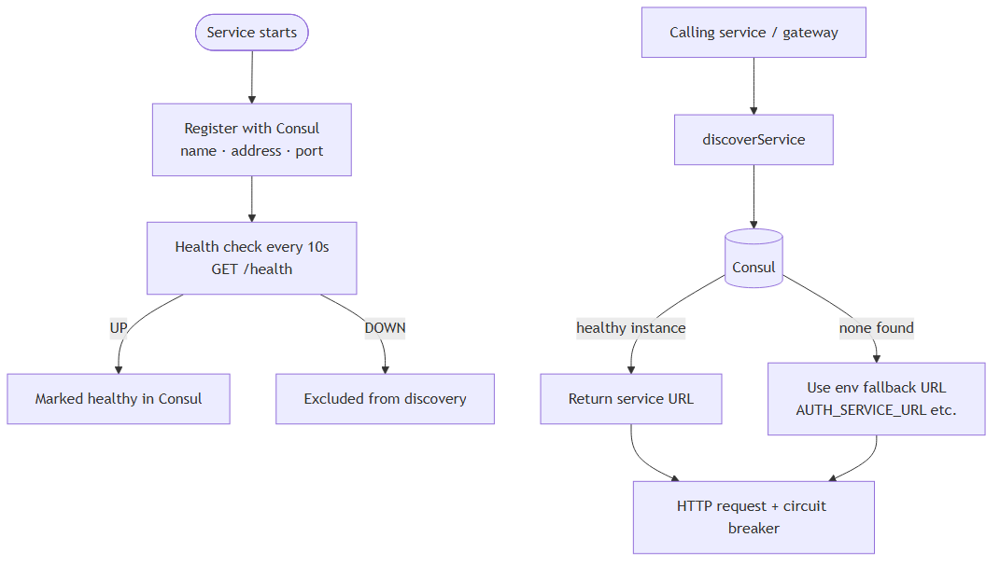

<details>
<summary>Show Mermaid source</summary>

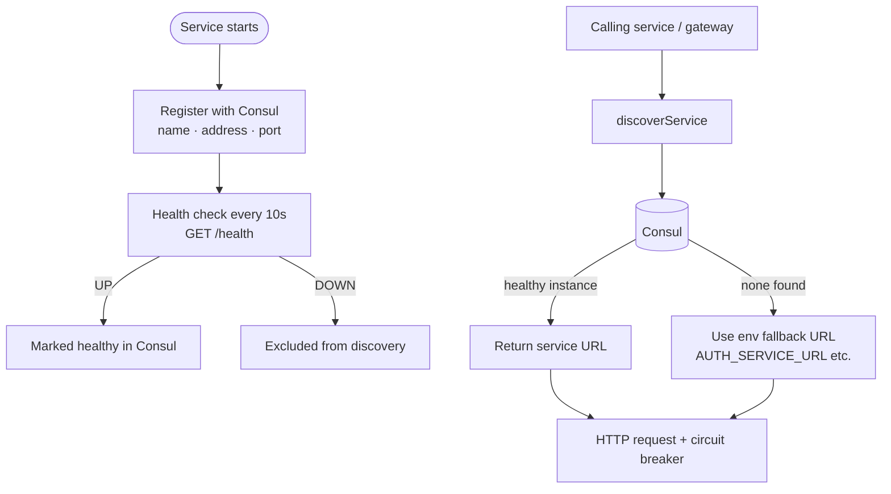

</details>

---

## 6. Cross-cutting concerns

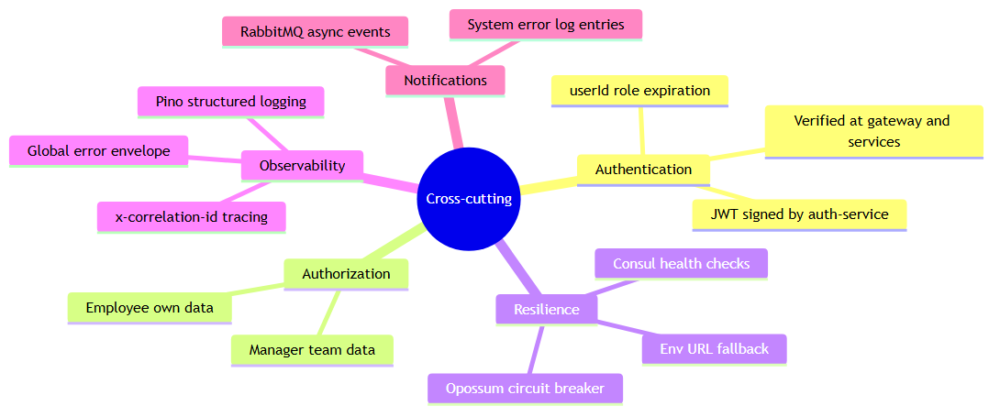

<details>
<summary>Show Mermaid source</summary>

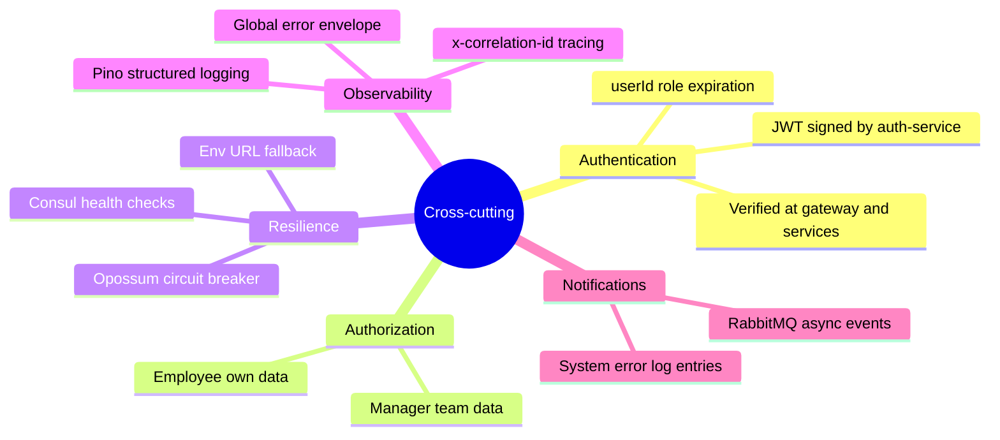

</details>

| Concern | Implementation |
|---|---|
| **Authentication** | JWT signed by auth-service, verified by gateway and all protected services |
| **Authorization** | Role-based (Employee / Manager) enforced per endpoint |
| **Service discovery** | Consul registration + `/health` checks every 10s |
| **Circuit breaker** | Opossum on all outbound HTTP (gateway + inter-service) |
| **Distributed tracing** | `x-correlation-id` header propagated across all calls |
| **Logging** | Pino (Fastify) JSON structured logs |
| **Global errors** | Consistent `{ success, error, correlationId }` envelope |
| **Notifications** | RabbitMQ log entries + HTTP system-error endpoint (no email/SMS) |

---

## 7. Deployment architecture (Docker Compose)


<details>
<summary>Show Mermaid source</summary>

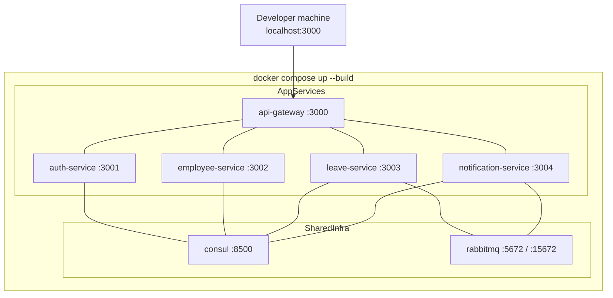

</details>

---

## 8. Data storage

In-memory `Map` stores per service, seeded on startup. No external database.

| Service | Store | Seed data |
|---|---|---|
| auth-service | `userStore` | MGR001, EMP001, EMP002 |
| employee-service | `balanceStore` | Balances for EMP001, EMP002 |
| leave-service | `leaveStore` | Empty (populated on apply) |
| notification-service | `notificationStore` | Empty (populated by events) |

### Leave allocation (automatic on employee create)

| Type | Days |
|---|---|
| Casual | 12 |
| Sick | 10 |
| Privilege | 15 |

---

## 9. Public API surface (via gateway)

All routes prefixed with `/api` except `/health`.

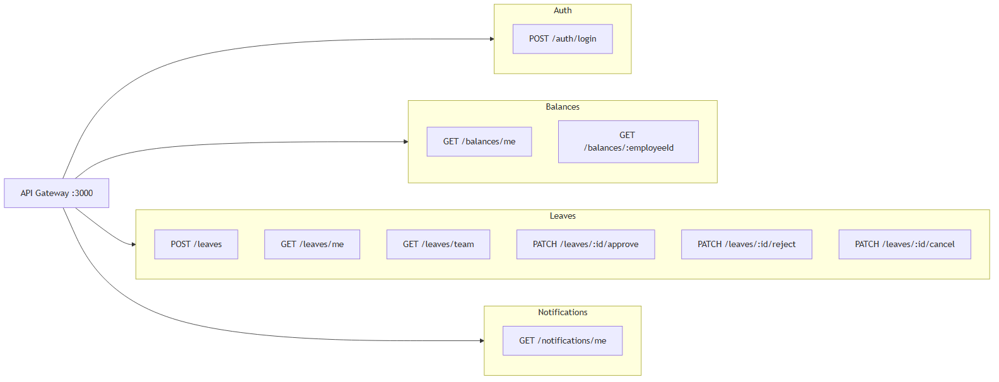

<details>
<summary>Show Mermaid source</summary>

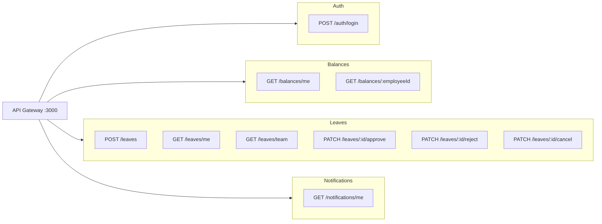

</details>

---

## 10. ASCII diagram (plain-text fallback)

```text
                         +-------------+
                         |   Client    |
                         +------+------+
                                |
                                v
                         +-------------+
                         | API Gateway | :3000
                         | JWT + Proxy |
                         +------+------+
                                |
            +-------------------+-------------------+
            |                   |                   |
            v                   v                   v
     +-------------+    +-------------+    +------------------+
     | auth-service|    |employee-svc |    |  leave-service   |
     |    :3001    |    |    :3002     |    |      :3003       |
     +------+------+    +------+------+    +---------+--------+
            |                   |                    |
            |                   |                    | publish
            |                   |                    v
            |                   |           +------------------+
            |                   |           |    RabbitMQ      |
            |                   |           +---------+--------+
            |                   |                     |
            |                   |                     v
            |                   |           +------------------+
            |                   |           | notification-svc |
            |                   |           |      :3004       |
            +-------------------+-----------+------------------+
                                |
                         +------+------+
                         |   Consul    | :8500
                         |  registry   |
                         +-------------+
```
